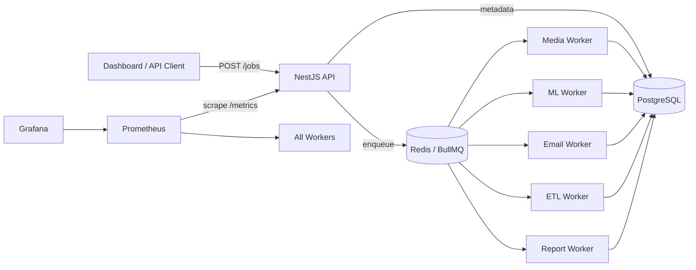

# Orchestrate — Distributed Job Queue & Worker System

Enterprise-grade asynchronous job processing platform built with **NestJS**, **BullMQ**, **Redis**, and **PostgreSQL**.

[](https://github.com/basanta1-github/Orchestrate/actions/workflows/ci.yml)
[](https://github.com/basanta1-github/Orchestrate/actions/workflows/docker-publish.yml)

> **Orchestrate** (JobQue) — multi-tenant job queue with NestJS API, BullMQ workers, PostgreSQL metadata, Redis queues, Prometheus/Grafana observability, and Kubernetes-ready deployments.

**Live demo URLs (local Docker):** API `http://localhost:3001` · Dashboard `http://localhost:3001/dashboard/` · Grafana `http://localhost:3002`

## Architecture

```
Orchestrate/
├── api/ NestJS REST API
├── workers/ BullMQ workers (media, ml, email, etl, report)
├── shared/ Core shared modules
├── dashboard/ Web UI
├── monitoring/ Prometheus + Grafana
├── k8s/ Kubernetes configs
├── deploy/ Cloud deployment
└── docker-compose.yml
```

**Package dependency chain:** `shared` → `workers` → `api` (packed as `.tgz` artifacts)

### System Flow



### Worker Topology

| Worker        | Queue         | Job Types                                                     |
| ------------- | ------------- | ------------------------------------------------------------- |
| media-worker  | `media-jobs`  | `video_transcode`, `audio_transcode`, `image_resize`          |
| ml-worker     | `ml-jobs`     | ML inference (`taskType`: summarization, classification, ocr) |
| email-worker  | `email-jobs`  | SMTP email delivery                                           |
| etl-worker    | `etl-jobs`    | Extract → Transform → Load pipelines                          |
| report-worker | `report-jobs` | PDF report generation                                         |

## Prerequisites

- Node.js **20+**
- Docker Desktop (Compose v2)
- Git
- (Optional) kubectl + a Kubernetes cluster for production deploy

## Quick Start (Docker — recommended)

```bash
git clone https://github.com/basanta1-github/Orchestrate.git
cd Orchestrate
# Environment
cp .env.example .env        # Linux/Mac
# Copy-Item .env.example .env   # Windows PowerShell
# Core stack: API + Postgres + Redis + 5 workers
docker compose up --build -d
# Monitoring: Prometheus + Grafana + Alertmanager (optional profile)
docker compose --profile monitoring up -d
# Or one command from repo root:
# npm run docker:full


```

### Verify

```bash
| Service        | URL                                      | Notes                          |
| -------------- | ---------------------------------------- | ------------------------------ |
| API health     | http://localhost:3001/health             | `{"status":"ok"}`              |
| Metrics health | http://localhost:3001/metrics/health       | Load-balancer style health     |
| Dashboard      | http://localhost:3001/dashboard/         | Register → submit jobs         |
| Prometheus     | http://localhost:9090                    | Targets: all `jobque-*` UP     |
| Grafana        | http://localhost:3002                    | Default `admin` / `admin`      |
| Alertmanager   | http://localhost:9093                    | Alert routing (demo config)    |

```

**Automated smoke test**
(health + register + ML job lifecycle):

```bash
npm run verify:m1
npm run verify:m1:health # health endpoints only
```

Grafana datasource URL (inside Grafana): http://prometheus:9090

Prometheus in your browser: http://localhost:9090 (not http://prometheus:9090)

If Grafana login fails after recreating containers:

```bash
docker compose exec grafana grafana-cli admin reset-admin-password admin

```

## First-time demo

1. Open http://localhost:3001/dashboard/
2. Click **Register** — create a tenant and admin user
3. Submit a job:
   - **Easy (no S3):** `ml-jobs` → `text_summarization` with **at least 20 characters** of input
   - **Media:** `image_resize` (may need local files or S3 in `.env`)
4. Watch status in the jobs table (auto-refresh ~every 5s): `QUEUED` → `PROCESSING` → `COMPLETED`
5. Open Grafana → **JobQue — System Overview** (or Explore: `up{job="jobque-worker"}`)
6. Optional: Prometheus → **Status → Targets** — `jobque-api` + 5 workers should be **UP**

## Local Development (without full Docker)

```bash
# Infra only
docker compose up -d db redis

# Update .env: DB_HOST=localhost, REDIS_HOST=localhost
npm run build:all
npm run dev:api

# Separate terminal — start one worker
cd workers
$env:WORKER_TYPE="media"   # PowerShell
node dist/main.js
```

## 🧑‍💻 Local Development (IMPORTANT)

Run system WITHOUT Docker full stack:

Step 1 — Shared

```bash
cd shared
npm install
npm run watch
```

Step 2 — Workers

```bash
cd workers
npm install
npm run watch
```

Step 3 — API

```bash
cd api
npm install
npm run watch
```

💡 Result

Now your system runs locally:

API → localhost:3001
Workers → auto-consume jobs
Shared → live rebuild

👉 Enjoy the server in local setup

## NPM Scripts

| Script                      | Description                                     |
| --------------------------- | ----------------------------------------------- |
| `npm run build:all`         | Build shared → workers → api (local dev)        |
| `npm run dev:api`           | NestJS watch mode (after `build:all`)           |
| `npm run docker:up`         | Build & start core Docker stack                 |
| `npm run docker:down`       | Stop all compose services                       |
| `npm run docker:full`       | Core stack + monitoring profile                 |
| `npm run docker:monitoring` | Start Prometheus/Grafana/Alertmanager only      |
| `npm run docker:logs`       | Follow API logs                                 |
| `npm run docker:ps`         | Container status                                |
| `npm run verify:m1`         | Health + register + ML job until COMPLETED      |
| `npm run verify:m1:health`  | `/health` and `/metrics/health` only            |
| `npm run verify:monitoring` | Curl Prometheus/Grafana (bash)                  |
| `npm run verify:k8s`        | Post-deploy K8s checks (bash)                   |
| `npm run migration:run`     | Apply PostgreSQL migrations                     |
| `npm run k8s:apply`         | `kubectl apply -k k8s/`                         |
| `npm run k8s:deploy`        | Full deploy script (bash / Git Bash on Windows) |
| `npm run k8s:status`        | Pods + HPA in `orchestrate` namespace           |

## API Endpoints

| Method | Path              | Auth   | Description                   |
| ------ | ----------------- | ------ | ----------------------------- |
| POST   | `/auth/register`  | Public | Create tenant + admin         |
| POST   | `/auth/login`     | Public | Get JWT token                 |
| POST   | `/jobs`           | Admin  | Submit a job                  |
| GET    | `/jobs`           | User   | List jobs (tenant-scoped)     |
| GET    | `/jobs/:id`       | User   | Job detail + logs             |
| POST   | `/jobs/workflow`  | Admin  | Chained job workflow          |
| GET    | `/metrics`        | Public | Prometheus scrape             |
| GET    | `/metrics/queues` | Public | Queue depth snapshot          |
| GET    | `/health`         | Public | Load balancer health          |
| GET    | `/metrics/health` | Public | Metrics subsystem health (LB) |

## CI/CD

GitHub Actions (`.github/workflows/`):

| Workflow               | Trigger                           | What it does                                                                       |
| ---------------------- | --------------------------------- | ---------------------------------------------------------------------------------- |
| **ci.yml**             | Push/PR to `main`, `develop`      | `build:all`, ESLint, unit tests, Docker smoke build (API + worker images, no push) |
| **docker-publish.yml** | Push to `main`, tags `v*`, manual | Build and push to GHCR                                                             |
| **deploy-k8s.yml**     | Manual only                       | Deploy to cluster using `KUBE_CONFIG_DATA` and repo secrets                        |

**Published images (GHCR):**

ghcr.io/basanta1-github/orchestrate-api:latest
ghcr.io/basanta1-github/orchestrate-worker:latest

## Kubernetes

**Prerequisites:** kubectl, a cluster, images on GHCR (from `docker-publish.yml`).

```bash
cp k8s/secrets.example.yaml k8s/secrets.yaml
# Edit JWT_SECRET, DB_PASS, optional SMTP/S3
kubectl apply -f k8s/secrets.yaml
kubectl apply -k k8s/
# Or: npm run k8s:deploy   (requires bash)
kubectl get pods -n orchestrate -w
kubectl rollout status deployment/api -n orchestrate
npm run migration:run
```

Manifests include:

- API Deployment (2 replicas) + HPA (2–6 pods)
- 5 worker Deployments, each with independent HPA
- PostgreSQL, Redis, Prometheus, Grafana
- Ingress for API + Grafana

## Environment variables

Copy `.env.example` → `.env`. Key settings:

```markdown
| Variable                          | Docker Compose | Local dev (host) | Notes                                          |
| --------------------------------- | -------------- | ---------------- | ---------------------------------------------- |
| `DB_HOST`                         | `db`           | `localhost`      | PostgreSQL                                     |
| `REDIS_HOST`                      | `redis`        | `localhost`      | BullMQ                                         |
| `API_PORT`                        | `3001`         | `3001`           | API + dashboard                                |
| `JWT_SECRET`                      | required       | required         | Use long random string in prod                 |
| `DB_SYNCHRONIZE`                  | `true` (dev)   | `true` (dev)     | **Set `false` in production** — use migrations |
| `GRAFANA_ADMIN_USER` / `PASSWORD` | optional       | —                | Grafana login                                  |
| `USE_S3`, `AWS_*`                 | optional       | optional         | Media worker uploads                           |
| `SMTP_*`                          | optional       | optional         | Email worker                                   |

See `.env.example` for the full list.
```

## Production checklist

Before deploying to a real environment:

- [ ] CI green on `main` ([Actions](https://github.com/basanta1-github/Orchestrate/actions))
- [ ] Strong `JWT_SECRET` and `DB_PASS` (not defaults)
- [ ] `NODE_ENV=production`
- [ ] `DB_SYNCHRONIZE=false` and `npm run migration:run`
- [ ] TLS on ingress / reverse proxy
- [ ] Do not expose Postgres/Redis ports publicly
- [ ] Configure SMTP (email) and S3 (media) if those workers are used
- [ ] Grafana admin password changed; Prometheus/Grafana not public without auth
- [ ] GHCR pull secret if images are private

## Troubleshooting

| Issue                                                            | Fix                                                                                        |
| ---------------------------------------------------------------- | ------------------------------------------------------------------------------------------ |
| Docker build `EINTEGRITY` on `@jobque/shared`                    | Dockerfiles install packed tarballs before `npm ci`; run `docker compose build --no-cache` |
| `verify:m1` job 400 on `priorityLevel`                           | Use valid levels: `HIGH`, `MEDIUM`, `LOW`, `NONE`                                          |
| ML job `FAILED`: input too short                                 | Summarization needs **≥ 20 characters**                                                    |
| Grafana `ERR_NAME_NOT_RESOLVED` for `prometheus:9090` in browser | Use `localhost:9090` in browser; `http://prometheus:9090` only inside Grafana datasource   |
| Grafana login fails                                              | `grafana-cli admin reset-admin-password admin`                                             |
| Job stuck `QUEUED`                                               | Check worker logs: `docker compose logs ml-worker --tail 50`                               |

## Cloud Deployment

See [deploy/README.md](deploy/README.md) for:

- DigitalOcean App Platform (`deploy/digitalocean/app.yaml`)
- Generic Kubernetes (DOKS, EKS, GKE)
- Post-deploy verification checklist

## Tech Stack

| Layer      | Technology                              |
| ---------- | --------------------------------------- |
| Runtime    | Node.js 20                              |
| Framework  | NestJS 11                               |
| Queue      | BullMQ 5 + Redis 7                      |
| Database   | PostgreSQL 15 + TypeORM                 |
| Metrics    | Prometheus + Grafana                    |
| Containers | Docker Compose (dev), Kubernetes (prod) |
| CI/CD      | GitHub Actions                          |

## License

ISC @Basanta_Pokhrel
