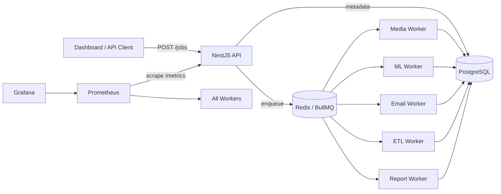

# Orchestrate — Distributed Job Queue & Worker System

Enterprise-grade asynchronous job processing platform built with **NestJS**, **BullMQ**, **Redis**, and **PostgreSQL**.

## Architecture

```
Orchestrate/
├── api/           # NestJS REST API (job submission, auth, metrics, dashboard)
├── workers/       # BullMQ worker processes (media, ml, email, etl, report)
├── shared/        # @jobque/shared — entities, queue, auth, metrics, scaling
├── dashboard/     # Web UI demo (submit jobs, track status, queue metrics)
├── monitoring/    # Prometheus + Grafana + Alertmanager
├── k8s/           # Kubernetes deployments, HPA, ingress
├── deploy/        # Cloud deployment guides (DigitalOcean, K8s)
└── docker-compose.yml
```

**Package dependency chain:** `shared` → `workers` → `api` (packed as `.tgz` artifacts)

### System Flow



### Worker Topology

| Worker        | Queue         | Job Types                                                     |
| ------------- | ------------- | ------------------------------------------------------------- |
| media-worker  | `media-jobs`  | `video_transcode`, `audio_transcode`, `image_resize`          |
| ml-worker     | `ml-jobs`     | ML inference (`taskType`: summarization, classification, ocr) |
| email-worker  | `email-jobs`  | SMTP email delivery                                           |
| etl-worker    | `etl-jobs`    | Extract → Transform → Load pipelines                          |
| report-worker | `report-jobs` | PDF report generation                                         |

## Prerequisites

- Node.js **20+**
- Docker Desktop (Compose v2)
- Git
- (Optional) kubectl + a Kubernetes cluster for production deploy

## Quick Start (Docker — recommended)

```bash
git clone https://github.com/basanta1-github/Orchestrate.git
cd Orchestrate

# Environment
cp .env.example .env        # Linux/Mac
# Copy-Item .env.example .env   # Windows PowerShell

# Start core stack
docker compose up --build -d

# Start monitoring (Prometheus + Grafana)
docker compose --profile monitoring up -d
```

### Verify

| Service    | URL                                 |
| ---------- | ----------------------------------- |
| API health | http://localhost:3001/health        |
| Dashboard  | http://localhost:3001/dashboard/    |
| Grafana    | http://localhost:3002 (admin/admin) |
| Prometheus | http://localhost:9090               |

```bash
npm run verify:m1
```

### First-time demo

1. Open http://localhost:3001/dashboard/
2. Click **Register** — create a tenant and admin user
3. Submit an `image_resize` job (pre-filled metadata template)
4. Watch job status update in the jobs table (auto-refresh every 5s)
5. Open Grafana to view queue depth, worker health, and failure metrics

## Local Development (without full Docker)

```bash
# Infra only
docker compose up -d db redis

# Update .env: DB_HOST=localhost, REDIS_HOST=localhost
npm run build:all
npm run dev:api

# Separate terminal — start one worker
cd workers
$env:WORKER_TYPE="media"   # PowerShell
node dist/main.js
```

## NPM Scripts

| Script                      | Description                             |
| --------------------------- | --------------------------------------- |
| `npm run build:all`         | Build shared → workers → api            |
| `npm run docker:up`         | Build & start all Docker services       |
| `npm run docker:down`       | Stop all services                       |
| `npm run docker:monitoring` | Start Prometheus + Grafana              |
| `npm run verify:m1`         | Health-check API endpoints              |
| `npm run k8s:deploy`        | Deploy to Kubernetes (requires secrets) |

## API Endpoints

| Method | Path              | Auth   | Description               |
| ------ | ----------------- | ------ | ------------------------- |
| POST   | `/auth/register`  | Public | Create tenant + admin     |
| POST   | `/auth/login`     | Public | Get JWT token             |
| POST   | `/jobs`           | Admin  | Submit a job              |
| GET    | `/jobs`           | User   | List jobs (tenant-scoped) |
| GET    | `/jobs/:id`       | User   | Job detail + logs         |
| POST   | `/jobs/workflow`  | Admin  | Chained job workflow      |
| GET    | `/metrics`        | Public | Prometheus scrape         |
| GET    | `/metrics/queues` | Public | Queue depth snapshot      |
| GET    | `/health`         | Public | Load balancer health      |

## Milestone Progress

- [x] M1 — Project setup, Docker, README
- [x] M2 — Database schemas & migrations
- [x] M3 — POST /jobs
- [x] M4 — Worker base module
- [x] M5 — Job tracking API
- [x] M6 — Retry, backoff, DLQ
- [x] M7 — Video/audio transcoding
- [x] M8 — Image processing
- [x] M9 — PDF reports
- [x] M10 — ML inference
- [x] M11 — Email/notifications
- [x] M12 — ETL pipeline
- [x] M13 — Job scheduling (delay + cron)
- [x] M14 — Chained jobs
- [x] M15 — Multi-tenancy
- [x] M16 — Queue prioritization
- [x] M17 — Worker scaling (in-process autoscale)
- [x] M18 — Monitoring (Prometheus + Grafana)
- [x] M19 — Security (JWT, RBAC, validation)
- [x] M20 — CI/CD, K8s, HPA, dashboard demo, cloud deploy docs

## CI/CD

GitHub Actions workflows in `.github/workflows/`:

- **ci.yml** — build all packages, lint, test, Docker build on every push/PR
- **docker-publish.yml** — push images to `ghcr.io` on version tags; optional K8s deploy via `KUBE_CONFIG_DATA` secret

## Kubernetes

```bash
cp k8s/secrets.example.yaml k8s/secrets.yaml
# Edit secrets, then:
npm run k8s:deploy
```

Manifests include:

- API Deployment (2 replicas) + HPA (2–6 pods)
- 5 worker Deployments, each with independent HPA
- PostgreSQL, Redis, Prometheus, Grafana
- Ingress for API + Grafana

## Cloud Deployment

See [deploy/README.md](deploy/README.md) for:

- DigitalOcean App Platform (`deploy/digitalocean/app.yaml`)
- Generic Kubernetes (DOKS, EKS, GKE)
- Post-deploy verification checklist

## Tech Stack

| Layer      | Technology                              |
| ---------- | --------------------------------------- |
| Runtime    | Node.js 20                              |
| Framework  | NestJS 11                               |
| Queue      | BullMQ 5 + Redis 7                      |
| Database   | PostgreSQL 15 + TypeORM                 |
| Metrics    | Prometheus + Grafana                    |
| Containers | Docker Compose (dev), Kubernetes (prod) |
| CI/CD      | GitHub Actions                          |

## License

ISC
