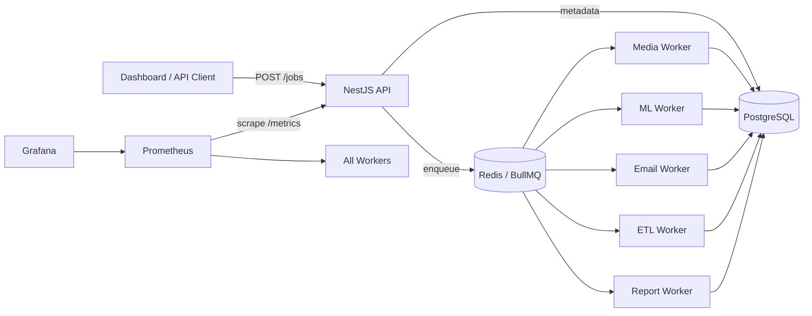

# Orchestrate

**Distributed job queue & worker system** — submit jobs over HTTP, process them asynchronously on specialized workers, track every state in PostgreSQL, queue with Redis/BullMQ, observe with Prometheus/Grafana, and deploy locally on **Docker Compose** or **Minikube Kubernetes** at **zero cloud cost**.

[CI](https://github.com/basanta1-github/Orchestrate/actions/workflows/ci.yml)
[Docker Publish](https://github.com/basanta1-github/Orchestrate/actions/workflows/docker-publish.yml)

> **Orchestrate** (JobQue) — multi-tenant job queue with NestJS API, BullMQ workers, PostgreSQL metadata, Redis queues, Prometheus/Grafana observability, and Kubernetes-ready deployments.

**Author:** Basanta Pokhrel  
**License:** ISC

**Local URLs (Docker Compose):** API `http://localhost:3001` · Dashboard `http://localhost:3001/dashboard/` · Grafana `http://localhost:3002` · Prometheus `http://localhost:9090`

---

## Table of contents

1. [What is this? (60-second pitch)](#what-is-this-60-second-pitch)
2. [System flow](#system-flow)
3. [Worker topology](#worker-topology)
4. [What runs when you deploy (Minikube)](#what-runs-when-you-deploy-minikube)
5. [How a job flows through the system](#how-a-job-flows-through-the-system)
6. [20-milestone map (M0 → M20)](#20-milestone-map-m0--m20)
7. [Repository layout](#repository-layout)
8. [Prerequisites](#prerequisites)
9. [Quick start — Docker Compose (recommended first)](#quick-start--docker-compose-recommended-first)
10. [Verify & automated smoke tests](#verify--automated-smoke-tests)
11. [First-time demo walkthrough](#first-time-demo-walkthrough)
12. [Local development without full Docker/Kubernetes](#local-development-without-full-dockerkubernetes)
13. [Deploy locally — Minikube Kubernetes](#deploy-locally--minikube-kubernetes)
14. [Kubernetes: how images get into the cluster](#kubernetes-how-images-get-into-the-cluster)
15. [NPM scripts](#npm-scripts)
16. [API endpoints](#api-endpoints)
17. [CI/CD](#cicd)
18. [Environment variables](#environment-variables)
19. [Job output files & storage](#job-output-files--storage)
20. [Docker: volumes, persistence, file access](#docker-volumes-persistence-file-access)
21. [Production checklist](#production-checklist)
22. [Troubleshooting](#troubleshooting)
23. [Cloud deployment (optional, paid)](#cloud-deployment-optional-paid)
24. [Tech stack](#tech-stack)
25. [Skills demonstrated](#skills-demonstrated)
26. [License](#license)

---

## What is this? (60-second pitch)

| Question                        | Answer                                                                                                                                                                      |
| ------------------------------- | --------------------------------------------------------------------------------------------------------------------------------------------------------------------------- |
| **What problem does it solve?** | Web requests should not block on slow work (video transcode, PDF, ML, email). Jobs go to a queue; workers process them in the background.                                   |
| **What did I build?**           | REST API + dashboard + 5 worker types + PostgreSQL + Redis/BullMQ + JWT multi-tenancy + Prometheus/Grafana + Docker Compose + Kubernetes (Minikube) + GitHub Actions CI/CD. |
| **Who runs the server?**        | **Docker containers** or **Kubernetes Pods** — not your Windows process as the production server. Your PC only runs Docker Desktop / Minikube / `kubectl`.                  |
| **Do I need to pay for cloud?** | **No.** Full project demo runs locally at $0. Cloud is optional.                                                                                                            |

---

## System flow



**Package dependency chain:** `shared` → `workers` → `api` (packed as `.tgz` artifacts inside Docker/K8s builds)

---

## Worker topology

| Worker | Deployment name | Queue         | Job types                                            | Heavy deps       |
| ------ | --------------- | ------------- | ---------------------------------------------------- | ---------------- |
| Media  | `media-worker`  | `media-jobs`  | `video_transcode`, `audio_transcode`, `image_resize` | FFmpeg, Sharp    |
| ML     | `ml-worker`     | `ml-jobs`     | summarization, classification, OCR                   | Local ML engines |
| Email  | `email-worker`  | `email-jobs`  | SMTP email delivery                                  | Nodemailer       |
| ETL    | `etl-worker`    | `etl-jobs`    | Extract → Transform → Load                           | —                |
| Report | `report-worker` | `report-jobs` | PDF report generation                                | Puppeteer        |

**One worker Docker image** — role selected by env `WORKER_TYPE=media|ml|email|etl|report`.

**Design rule:** `RUN_WORKERS_IN_API=false` in Docker/K8s — API never runs heavy processors in the same process.

---

## What runs when you deploy (Minikube)

After `kubectl apply -k k8s/overlays/local-storage`, namespace `**orchestrate`\*\* contains:

| Deployment      | Replicas (default) | Port | Role                        |
| --------------- | ------------------ | ---- | --------------------------- |
| `api`           | 1                  | 3001 | HTTP, dashboard, metrics    |
| `media-worker`  | 2                  | 3001 | `/metrics` health           |
| `ml-worker`     | 1                  | 3001 | ML jobs                     |
| `email-worker`  | 1                  | 3001 | Email jobs                  |
| `etl-worker`    | 1                  | 3001 | ETL jobs                    |
| `report-worker` | 1                  | 3001 | PDF jobs                    |
| `postgres`      | 1                  | 5432 | Job metadata DB             |
| `redis`         | 1                  | 6379 | BullMQ                      |
| `prometheus`    | 1                  | 9090 | Metrics collection          |
| `grafana`       | 1                  | 3000 | Dashboards                  |
| `alertmanager`  | 1                  | 9093 | Alerts (demo config in K8s) |

Also: **Services**, **Ingress** (`orchestrate.local`), **HPA** on API + workers (needs metrics-server).

**In-cluster DNS examples:** `postgres:5432`, `redis:6379`, `api:3001`, `prometheus:9090`

Config: `k8s/configmap.yaml` + `k8s/secrets.yaml`

---

## How a job flows through the system

```
POST /jobs → DB: QUEUED → BullMQ: waiting → Worker: PROCESSING → DB: COMPLETED | FAILED
                                    ↓
                         retry + exponential backoff → DLQ after max attempts
```

1. Client sends `POST /jobs` with JWT (admin for submit).
2. API writes row to PostgreSQL (`QUEUED`), enqueues to Redis/BullMQ.
3. Matching worker consumes job, sets `PROCESSING`, runs processor.
4. Worker writes result + `COMPLETED` or `FAILED` + logs to PostgreSQL.
5. Dashboard polls `GET /jobs/:id` (~every 5s).
6. Prometheus scrapes `/metrics` from API and all workers.

---

## 20-milestone map (M0 → M20)

| Phase                        | #   | Milestone                              | Status                    | Where                                               |
| ---------------------------- | --- | -------------------------------------- | ------------------------- | --------------------------------------------------- |
| **1 Foundation**             | 1   | Project setup, Docker, monorepo        | ✅                        | `api/`, `workers/`, `shared/`, `docker-compose.yml` |
|                              | 2   | PostgreSQL schemas                     | ✅                        | `shared/src/database/entities/`                     |
|                              | 3   | POST `/jobs`                           | ✅                        | `shared/src/jobs/`                                  |
|                              | 4   | Base worker module                     | ✅                        | `workers/src/base-worker/`                          |
|                              | 5   | Job tracking API                       | ✅                        | `shared/src/jobs/jobs.controller.ts`                |
| **2 Processing**             | 6   | Retries, backoff, DLQ metrics          | ✅                        | BullMQ + `shared/src/metrics/`                      |
|                              | 7   | Media (FFmpeg)                         | ✅                        | `workers/src/media-worker/`                         |
|                              | 8   | Image processing                       | ✅                        | `workers/src/media-worker/`                         |
|                              | 9   | PDF reports                            | ✅                        | `workers/src/report-worker/`                        |
|                              | 10  | ML inference                           | ✅                        | `workers/src/ml-worker/`                            |
| **3 Orchestration**          | 11  | Email worker                           | ✅                        | `workers/src/email-worker/`                         |
|                              | 12  | ETL + batch jobs                       | ✅                        | `workers/src/etl-worker/`, `shared/src/batch-job/`  |
|                              | 13  | Delayed & recurring (cron)             | ✅                        | `shared/src/queue/queue.service.ts`                 |
|                              | 14  | Chained job dependencies               | ✅                        | `shared/src/chain/`                                 |
| **4 Enterprise**             | 15  | Multi-tenant + JWT RBAC                | ✅                        | `shared/src/auth/`, `shared/src/rbac/`              |
|                              | 16  | Priority bands, tenant caps            | ✅                        | `shared/src/scaling/`                               |
|                              | 17  | Multi-instance workers, HPA            | ✅                        | `k8s/workers.yaml`, HPA manifests                   |
| **5 Observability & deploy** | 18  | Prometheus + Grafana + alerts          | ✅                        | `monitoring/`, `k8s/monitoring.yaml`                |
|                              | 19  | Security hardening, validation         | ✅                        | JWT guards, tenant-scoped queries                   |
|                              | 20  | Docker, K8s/Minikube, CI/CD, dashboard | ✅ local · cloud optional | `.github/workflows/`, `k8s/`, `dashboard/`          |

> **M20 cloud demo** is documented but **not required** — local Minikube + Docker Compose completes the project at $0.

---

## Repository layout

```
Orchestrate/
├── api/              NestJS REST API + serves dashboard
├── workers/          BullMQ workers (one image, WORKER_TYPE selects role)
├── shared/           Jobs, auth, queue, DB, metrics — used by api + workers
├── dashboard/        Static web UI (register, submit jobs, watch status)
├── monitoring/       Prometheus, Grafana, Alertmanager configs
├── k8s/              Kubernetes manifests + overlays (local-storage, minikube, rwx-storage)
├── deploy/           Deployment guides (local + cloud)
├── docs/             DEPLOYMENT.md — cloud reference
├── scripts/          verify-m1.js, deploy-k8s.sh, verify-k8s.sh
└── docker-compose.yml
```

---

## Prerequisites

| Tool           | Version    | Required for                                   |
| -------------- | ---------- | ---------------------------------------------- |
| Node.js        | 20+        | verify scripts, local dev, migrations          |
| Docker Desktop | Compose v2 | Docker Compose path                            |
| Git            | any        | clone repo                                     |
| kubectl        | latest     | Kubernetes / Minikube                          |
| Minikube       | latest     | Local K8s path (optional if using Docker only) |

**RAM:** Docker Desktop or Minikube — **8 GB+** recommended for full stack.

---

## Quick start — Docker Compose (recommended first)

```bash
git clone https://github.com/basanta1-github/Orchestrate.git
cd Orchestrate

cp .env.example .env        # Linux/Mac
# Copy-Item .env.example .env   # Windows PowerShell
# Edit JWT_SECRET in .env

# Core stack: API + Postgres + Redis + 5 workers
docker compose up --build -d

# Monitoring: Prometheus + Grafana + Alertmanager (optional)
docker compose --profile monitoring up -d

# Or one command from repo root:
# npm run docker:full
```

---

## Verify & automated smoke tests

### Service URLs (Docker Compose)

| Service        | URL                                                                          | Notes                       |
| -------------- | ---------------------------------------------------------------------------- | --------------------------- |
| API health     | [http://localhost:3001/health](http://localhost:3001/health)                 | `{"status":"ok"}`           |
| Metrics health | [http://localhost:3001/metrics/health](http://localhost:3001/metrics/health) | Load-balancer style health  |
| Dashboard      | [http://localhost:3001/dashboard/](http://localhost:3001/dashboard/)         | Register → submit jobs      |
| Prometheus     | [http://localhost:9090](http://localhost:9090)                               | Status → Targets — all UP   |
| Grafana        | [http://localhost:3002](http://localhost:3002)                               | Default `admin` / `admin`   |
| Alertmanager   | [http://localhost:9093](http://localhost:9093)                               | Alert routing (demo config) |

**Grafana datasource URL (inside Grafana UI):** `http://prometheus:9090`  
**Prometheus in your browser:** `http://localhost:9090` (not `http://prometheus:9090`)

### Automated smoke tests

```bash
npm run verify:m1          # health + register + ML job until COMPLETED
npm run verify:m1:health   # /health and /metrics/health only
```

### If Grafana login fails after recreating containers

**Docker Compose:**

```bash
docker compose exec grafana grafana-cli admin reset-admin-password admin
```

**Kubernetes / Minikube:**

```powershell
kubectl exec -n orchestrate deployment/grafana -- grafana-cli admin reset-admin-password admin
```

Or port-forward Grafana first (`kubectl port-forward -n orchestrate svc/grafana 3002:3000`), then run the exec command above.

---

## First-time demo walkthrough

1. Open [http://localhost:3001/dashboard/](http://localhost:3001/dashboard/)
2. Click **Register** — create a tenant and admin user
3. Submit a job:

- **Easy (no S3):** `ml-jobs` → `text_summarization` with **at least 20 characters** of input
- **Media:** `image_resize` (may need local files or S3 in `.env` / secrets)

4. Watch status in the jobs table (auto-refresh ~every 5s): `QUEUED` → `PROCESSING` → `COMPLETED`
5. Open Grafana → **JobQue — System Overview** (or Explore: `up{job="orchestrate-worker"}`)
6. Optional: Prometheus → **Status → Targets** — API + 5 workers should be **UP**

---

## Local development without full Docker/Kubernetes

### Option A — Infra in Docker, API/workers on host

```bash
# Infra only
docker compose up -d db redis

# Update .env: DB_HOST=localhost, REDIS_HOST=localhost
npm run build:all
npm run dev:api

# Separate terminal — start one worker
cd workers
$env:WORKER_TYPE="media"   # PowerShell
node dist/main.js
```

### Option B — Watch mode (hot reload — recommended for coding)

Run **three terminals** (plus infra). On save, packages rebuild automatically — wait a few seconds after editing before sending API requests again.

**Prerequisites:** PostgreSQL + Redis running (infra only):

```bash
docker compose up -d db redis
# .env at repo root: DB_HOST=localhost, REDIS_HOST=localhost, JWT_SECRET=...
```

**Terminal 1 — Shared** (repacks `jobque-shared-1.0.0.tgz` on every save)

```bash
cd shared
npm install
npm run watch
```

**Terminal 2 — Workers** (repacks `jobque-workers-1.0.0.tgz` on every save)

```bash
cd workers
npm install
npm run watch
```

**Terminal 3 — API** (rebuilds deps + restarts NestJS on save — no manual restart)

```bash
cd api
npm install
npm run dev
```

**Terminal 4 — Run one worker** (pick a type; restart this terminal after large worker/shared changes)

```powershell
cd workers
$env:WORKER_TYPE="ml"   # or media, email, etl, report
node dist/main.js
```

**Result:**

| Terminal | URL / behavior                                                              |
| -------- | --------------------------------------------------------------------------- |
| API      | http://localhost:3001 — auto-restarts on save via `npm run dev`             |
| Workers  | `npm run watch` repacks tarball; worker process consumes jobs in Terminal 4 |
| Shared   | `npm run watch` repacks tarball consumed by workers + API                   |

**Tip:** After saving files in `shared/` or `workers/`, wait ~5–10s for `npm run pack` to finish, then hit the API again. The API terminal (`npm run dev`) picks up new `.tgz` files automatically.

**First-time only:** run `npm run build:all` once from repo root if tarballs don't exist yet.

---

## Deploy locally — Minikube Kubernetes

**Full step-by-step (Steps 0–10, migrations, secrets, verify):** **[docs/DEPLOYMENT.md](docs/DEPLOYMENT.md)**  
**Shorter checklist:** **[deploy/README.md](deploy/README.md)**

### Step 0 — Start Minikube

```powershell
minikube start --cpus=4 --memory=8192 --disk-size=6000 --driver=docker
minikube addons enable ingress
minikube addons enable metrics-server
kubectl cluster-info
kubectl config use-context minikube
```

> **Disk:** use `--disk-size=6000` (6 GB) if Minikube fails with disk allocation / insufficient storage errors.

### Step 1 — Secrets

```powershell
cd Orchestrate
Copy-Item k8s\secrets.example.yaml k8s\secrets.yaml
# Edit JWT_SECRET and DB_PASS (same password everywhere)
```

### Step 2 — Deploy

```powershell
kubectl apply -f k8s\namespace.yaml
kubectl apply -f k8s\secrets.yaml
kubectl apply -k k8s\overlays\local-storage
```

Why `local-storage`? Minikube is single-node; hostPath shares media/report dirs between API and workers (`/var/lib/orchestrate/media`, `/var/lib/orchestrate/reports`).

### Step 3 — Wait

```powershell
kubectl get pods -n orchestrate -w
kubectl rollout status deployment/api -n orchestrate
npm run k8s:status
```

### Step 4 — Access

```powershell
# Easiest on Windows:
kubectl port-forward -n orchestrate svc/api 3001:3001
# → http://localhost:3001/dashboard/

# Or Ingress:
minikube ip
# hosts file: <minikube-ip> orchestrate.local
minikube tunnel
# → http://orchestrate.local/dashboard/
```

### Step 5 — Verify

```powershell
npm run verify:m1:health
npm run verify:m1
```

### Optional — Migrations (production-style)

ConfigMap uses `DB_SYNCHRONIZE=true` for local learning (auto-creates tables). For migration workflow:

```powershell
# Use 5433 on your PC if local Postgres already uses 5432 — no need to stop it
kubectl port-forward -n orchestrate svc/postgres 5433:5432

$env:DB_HOST="localhost"
$env:DB_PORT="5433"
$env:DB_USER="postgres"
$env:DB_PASS="<from secrets>"
$env:DB_NAME="job_que"
npm run migration:run
```

---

## Kubernetes: how images get into the cluster

**Your PC is not the server** — it only runs `kubectl`. Containers run **inside Minikube**.

```
GitHub push to main
    → GitHub Actions (docker-publish.yml) builds api/Dockerfile + workers/Dockerfile
    → Pushes to GHCR:
        ghcr.io/basanta1-github/orchestrate-api:latest
        ghcr.io/basanta1-github/orchestrate-worker:latest

kubectl apply (your PC)
    → Kubernetes creates Pods on Minikube node
    → kubelet PULLS images from GHCR over the internet
    → Containers start ON THE CLUSTER
```

| Question                            | Answer                                                                                            |
| ----------------------------------- | ------------------------------------------------------------------------------------------------- |
| Do I build images on my PC for K8s? | **No** (default) — CI publishes to GHCR                                                           |
| Who pulls images?                   | **Minikube kubelet** when each Pod starts                                                         |
| `imagePullPolicy: Always`           | Re-check registry on every pod start                                                              |
| Public GHCR?                        | No pull secret needed                                                                             |
| Private GHCR?                       | Create `ghcr-pull` secret + uncomment `imagePullSecrets` in `k8s/api.yaml` and `k8s/workers.yaml` |

**After you change code and want K8s to run the new version** (you do not rebuild on your PC):

1. Commit and push to GitHub (`main`)
2. Wait for **docker-publish.yml** to finish (builds + pushes new images to GHCR)
3. Restart deployments so Minikube pulls fresh images:

```powershell
kubectl rollout restart deployment/api -n orchestrate
kubectl rollout restart deployment/ml-worker -n orchestrate
kubectl rollout restart deployment/media-worker -n orchestrate
kubectl rollout restart deployment/email-worker -n orchestrate
kubectl rollout restart deployment/etl-worker -n orchestrate
kubectl rollout restart deployment/report-worker -n orchestrate
```

4. Watch rollout: `kubectl rollout status deployment/api -n orchestrate`

Pin a tag in `k8s/kustomization.yaml` → `images:` → `newTag: v1.0.0` if you don't want `:latest`.

---

## NPM scripts

| Script                                     | Description                                           |
| ------------------------------------------ | ----------------------------------------------------- |
| `npm run build:all`                        | Build shared → workers → api (local dev)              |
| `npm run dev:api`                          | NestJS watch mode (after `build:all`)                 |
| `npm run dev` (in `api/`)                  | Hot reload — rebuilds tarballs + restarts API on save |
| `npm run watch` (in `shared/`, `workers/`) | Repacks `.tgz` on file save                           |
| `npm run docker:up`                        | Build & start core Docker stack                       |
| `npm run docker:down`                      | Stop all compose services                             |
| `npm run docker:full`                      | Core stack + monitoring profile                       |
| `npm run docker:monitoring`                | Start Prometheus/Grafana/Alertmanager only            |
| `npm run docker:logs`                      | Follow API logs                                       |
| `npm run docker:ps`                        | Container status                                      |
| `npm run verify:m1`                        | Health + register + ML job until COMPLETED            |
| `npm run verify:m1:health`                 | `/health` and `/metrics/health` only                  |
| `npm run verify:monitoring`                | Curl Prometheus/Grafana (bash)                        |
| `npm run verify:k8s`                       | Post-deploy K8s checks (bash)                         |
| `npm run migration:run`                    | Apply PostgreSQL migrations                           |
| `npm run k8s:apply`                        | `kubectl apply -k k8s/`                               |
| `npm run k8s:deploy`                       | Full deploy script (bash / Git Bash on Windows)       |
| `npm run k8s:status`                       | Pods + HPA in `orchestrate` namespace                 |

---

## API endpoints

| Method | Path              | Auth   | Description               |
| ------ | ----------------- | ------ | ------------------------- |
| POST   | `/auth/register`  | Public | Create tenant + admin     |
| POST   | `/auth/login`     | Public | Get JWT token             |
| POST   | `/jobs`           | Admin  | Submit a job              |
| GET    | `/jobs`           | User   | List jobs (tenant-scoped) |
| GET    | `/jobs/:id`       | User   | Job detail + logs         |
| POST   | `/jobs/workflow`  | Admin  | Chained job workflow      |
| GET    | `/metrics`        | Public | Prometheus scrape         |
| GET    | `/metrics/queues` | Public | Queue depth snapshot      |
| GET    | `/health`         | Public | Load balancer health      |
| GET    | `/metrics/health` | Public | Metrics subsystem health  |

---

## CI/CD

GitHub Actions (`.github/workflows/`):

| Workflow               | Trigger                            | What it does                                                        |
| ---------------------- | ---------------------------------- | ------------------------------------------------------------------- |
| **ci.yml**             | Push/PR to `main`, `develop`       | `build:all`, ESLint, unit tests, Docker smoke build                 |
| **docker-publish.yml** | Push to `main`, tags `v`\*, manual | Build and push to GHCR                                              |
| **deploy-k8s.yml**     | Manual only                        | Deploy to remote cluster (optional — not needed for local Minikube) |

**Published images (GHCR):**

```
ghcr.io/basanta1-github/orchestrate-api:latest
ghcr.io/basanta1-github/orchestrate-worker:latest
```

You can use the project **without ever running deploy-k8s.yml** — local `kubectl apply` is enough.

---

## Environment variables

Copy `.env.example` → `.env` for Docker/local dev. For Kubernetes: `k8s/secrets.yaml` + `k8s/configmap.yaml`.

### Core variables

| Variable                          | Docker Compose | Local dev (host) | K8s ConfigMap/Secret        | Notes                                   |
| --------------------------------- | -------------- | ---------------- | --------------------------- | --------------------------------------- |
| `DB_HOST`                         | `db`           | `localhost`      | `postgres`                  | PostgreSQL                              |
| `REDIS_HOST`                      | `redis`        | `localhost`      | `redis`                     | BullMQ                                  |
| `API_PORT`                        | `3001`         | `3001`           | `3001`                      | API + dashboard                         |
| `JWT_SECRET`                      | `.env`         | `.env`           | `secrets.yaml`              | Long random string                      |
| `DB_PASS`                         | `.env`         | `.env`           | `secrets.yaml`              | Must match Postgres                     |
| `DB_SYNCHRONIZE`                  | `true` (dev)   | `true` (dev)     | `true` local / `false` prod | Prod: use migrations                    |
| `RUN_WORKERS_IN_API`              | `false`        | optional `true`  | `false`                     | Separate workers in prod-like setups    |
| `USE_S3`, `AWS_*`                 | optional       | optional         | secrets + configmap         | Media/report durable storage            |
| `SMTP_*`                          | optional       | optional         | secrets                     | Email worker                            |
| `GRAFANA_ADMIN_USER` / `PASSWORD` | optional       | —                | configmap / secrets         | Grafana login                           |
| `TENANT_JOBS_PER_MINUTE`          | `0`            | `0`              | configmap                   | `0` = unlimited; e.g. `60` = rate limit |
| `QUEUE_DEPTH_POLLER`              | `true`         | `true`           | configmap                   | Queue metrics                           |

#### `JOB_DEMO_DELAY_MS` (demo / portfolio only)

Artificial delay (milliseconds) added at the **start** of every worker job **before** real processing.

| Value         | Effect                                   |
| ------------- | ---------------------------------------- |
| `0` (default) | No delay — normal speed                  |
| `10000`       | Hold each job 10 seconds in `PROCESSING` |

**Use when:** recording demos, watching Grafana/HPA, or showing queue behavior in the dashboard.

**Do not use in production.**

Set in:

| Environment                   | Where                                                                                                  |
| ----------------------------- | ------------------------------------------------------------------------------------------------------ |
| Docker Compose / local `.env` | `JOB_DEMO_DELAY_MS=10000`                                                                              |
| Kubernetes                    | `k8s/configmap.yaml` → `JOB_DEMO_DELAY_MS: "10000"` then `kubectl apply -k k8s/overlays/local-storage` |

Workers log: `DEMO delay: holding job ... for Nms` when active.

See `.env.example` for the full list.

### Environment variables: worker mode and output paths

#### `RUN_WORKERS_IN_API`

- `**true`\*\* — API process also starts worker consumers (media, report, etc.)
  - Best for quick local development with a single process
  - **Not recommended** for production/Kubernetes (breaks API/worker separation)
- `**false`\*\* (recommended default) — API only handles HTTP; workers run as separate processes/containers
  - Best for Docker Compose, Kubernetes, and production architecture

#### `MEDIA_OUTPUT_DIR`

Absolute/relative filesystem path where processed media files are stored.

- In Docker (shared volume): `MEDIA_OUTPUT_DIR=/app/shared/media`
- Local host (optional): `MEDIA_OUTPUT_DIR=processed_media` or absolute Windows path

Must match the API static serving path for `/processed_media/*`.

#### `REPORT_OUTPUT_DIR`

Filesystem path where generated report files (PDF) are stored.

- In Docker (shared volume): `REPORT_OUTPUT_DIR=/app/shared/reports`
- Local host (optional): `REPORT_OUTPUT_DIR=processed_report`

Must match the API static serving path for `/processed_report/*`.

**Important:** use a leading slash in Docker paths.  
`REPORT_OUTPUT_DIR=app/shared/reports` is **wrong** — use `/app/shared/reports`.

#### Recommended `.env` profiles

**1. Local quick dev (single process)**

```
RUN_WORKERS_IN_API=true
MEDIA_OUTPUT_DIR=processed_media
REPORT_OUTPUT_DIR=processed_report
```

**2. Docker Compose / production-like (separate workers)**

```
RUN_WORKERS_IN_API=false
MEDIA_OUTPUT_DIR=/app/shared/media
REPORT_OUTPUT_DIR=/app/shared/reports
```

#### One-line rule for contributors

- If workers run inside API (`RUN_WORKERS_IN_API=true`), local relative folders are fine.
- If workers run separately (`RUN_WORKERS_IN_API=false`), use shared absolute paths (or S3) so API and workers see the same files.

### Optional env table (extra rows)

| Variable            | Docker                             | Local                          | Notes                               |
| ------------------- | ---------------------------------- | ------------------------------ | ----------------------------------- |
| `MEDIA_OUTPUT_DIR`  | `/app/shared/media`                | unset → `api/processed_media`  | Must match API static path          |
| `REPORT_OUTPUT_DIR` | `/app/shared/reports`              | unset → `api/processed_report` | Must match API static path          |
| `USE_S3`            | optional / `true` in K8s configmap | optional                       | Preferred for durable cloud storage |
| `PUBLIC_API_URL`    | optional                           | optional                       | Embedded in job result `local.url`  |
| `SLACK_WEBHOOK_URL` | optional                           | optional                       | Alertmanager (see monitoring/)      |
| `HUNTER_API_KEY`    | optional                           | optional                       | Email verification (email worker)   |

---

## Job output files & storage

Completed media/report jobs store output paths in the job response:

```json
"result": {
  "local": {
    "url": "http://localhost:3001/processed_media/<file>",
    "path": "/app/shared/media/<file>"
  },
  "s3": "https://<bucket>.s3.<region>.amazonaws.com/<file>"
}
```

| Field        | Use                                                  |
| ------------ | ---------------------------------------------------- |
| `local.url`  | Open in browser                                      |
| `local.path` | Filesystem path inside the container (not a web URL) |
| `s3`         | Object storage when `USE_S3=true`                    |

### Local dev (npm, no Docker)

Files are written under the API/worker process folder, typically:

- `api/processed_media/`
- `api/processed_report/`

### Storage modes

| Mode                       | When                                               | Config                              |
| -------------------------- | -------------------------------------------------- | ----------------------------------- |
| **Path B — shared volume** | Docker Compose, Minikube (`local-storage` overlay) | Shared dirs / hostPath              |
| **Path A — S3**            | Cloud or durable prod                              | `USE_S3=true` + `AWS_`\* in secrets |

---

## Docker: volumes, persistence, file access

There is **no `/app` folder on your host**. Workers write to shared Docker volumes:

| Type    | Container path        | Compose volume |
| ------- | --------------------- | -------------- |
| Media   | `/app/shared/media`   | `media_data`   |
| Reports | `/app/shared/reports` | `report_data`  |

### List files

```bash
docker compose exec api ls -la /app/shared/media
docker compose exec api ls -la /app/shared/reports
```

### Copy a file to your machine

```bash
docker compose cp api:/app/shared/reports/<file>.pdf ./downloads/
```

### Persistence

| Action                                      | Data kept?               |
| ------------------------------------------- | ------------------------ |
| `docker compose stop` / `up` / `up --build` | Yes                      |
| `docker compose down`                       | Yes (volumes remain)     |
| `docker compose down -v`                    | **No** — volumes deleted |

For production, use S3 (`USE_S3=true`) so outputs survive container/volume lifecycle.

---

## Production checklist

Before deploying to a real (paid) environment:

- [ ] CI green on `main` ([Actions](https://github.com/basanta1-github/Orchestrate/actions))
- [ ] Strong `JWT_SECRET` and `DB_PASS` (not defaults)
- [ ] `NODE_ENV=production`
- [ ] `DB_SYNCHRONIZE=false` and `npm run migration:run`
- [ ] TLS on ingress / reverse proxy
- [ ] Do not expose Postgres/Redis ports publicly
- [ ] Configure SMTP (email) and S3 (media) if those workers are used
- [ ] Grafana admin password changed; Prometheus/Grafana not public without auth
- [ ] GHCR pull secret if images are private

**Local Minikube demo:** strong secrets + working verify script = sufficient for portfolio.

---

## Troubleshooting

| Issue                                                            | Fix                                                                                                                |
| ---------------------------------------------------------------- | ------------------------------------------------------------------------------------------------------------------ |
| Docker build `EINTEGRITY` on `@jobque/shared`                    | Run `docker compose build --no-cache`                                                                              |
| Docker Hub pull `EOF` / CloudFront error                         | Network/VPN; Docker DNS `8.8.8.8`; `max-concurrent-downloads: 1`; or Google mirror — see below                     |
| `verify:m1` job 400 on `priorityLevel`                           | Use `HIGH`, `MEDIUM`, `LOW`, `NONE`                                                                                |
| ML job `FAILED`: input too short                                 | Summarization needs **≥ 20 characters**                                                                            |
| Grafana `ERR_NAME_NOT_RESOLVED` for `prometheus:9090` in browser | Use `localhost:9090` in browser; `http://prometheus:9090` only inside Grafana                                      |
| Grafana login fails                                              | Docker or K8s reset — see **Reset Grafana password** below                                                         |
| Job stuck `QUEUED`                                               | Check worker logs: `docker compose logs ml-worker --tail 50` or `kubectl logs deployment/ml-worker -n orchestrate` |
| K8s `ImagePullBackOff`                                           | Internet/VPN; private GHCR → add pull secret                                                                       |
| K8s pod `Pending`                                                | Minikube RAM — `--memory=8192`; or disk — `--disk-size=6000`                                                       |
| HPA `TARGETS <unknown>`                                          | `minikube addons enable metrics-server`                                                                            |
| API `CrashLoopBackOff` in K8s                                    | Wrong `DB_PASS` or DB not ready — check logs                                                                       |
| Postgres port-forward fails / port in use                        | Local Postgres may already use **5432** — forward to another local port (see below)                                |
| Minikube disk allocation failed                                  | Increase disk: `minikube start --disk-size=6000` (see Step 0)                                                      |
| K8s still runs old code after edits                              | Push to GitHub → wait for `docker-publish.yml` → `kubectl rollout restart deployment/...` (see K8s images section) |
| Docker Hub pull fails (`EOF`, CloudFront)                        | Add Google registry mirror in Docker Desktop (see below)                                                           |

### Postgres port-forward — local port already in use

If you have **PostgreSQL installed locally** on port `5432`, do **not** stop it. Forward the cluster Postgres to a **different local port**:

```powershell
kubectl port-forward -n orchestrate svc/postgres 5433:5432
```

Then point migrations / clients at **`localhost:5433`**:

```powershell
$env:DB_HOST="localhost"
$env:DB_PORT="5433"
$env:DB_USER="postgres"
$env:DB_PASS="<from k8s/secrets.yaml>"
$env:DB_NAME="job_que"
npm run migration:run
```

Format: `kubectl port-forward ... <local-port>:5432` — left side is your PC, right side is the cluster.

### Minikube — disk allocation / storage errors

If Minikube fails to start or pods stay `Pending` with disk/volume errors, recreate with more disk:

```powershell
minikube delete
minikube start --cpus=4 --memory=8192 --disk-size=6000 --driver=docker
```

`--disk-size=6000` = 6 GB for the Minikube node.

### Reset Grafana password (all ways)

| Environment               | Command                                                                                          |
| ------------------------- | ------------------------------------------------------------------------------------------------ |
| **Docker Compose**        | `docker compose exec grafana grafana-cli admin reset-admin-password admin`                       |
| **Kubernetes / Minikube** | `kubectl exec -n orchestrate deployment/grafana -- grafana-cli admin reset-admin-password admin` |

Default after reset: user `admin`, password `admin` — change for anything beyond local demo.

### Kubernetes — run new code after GitHub push

Kubernetes does **not** auto-update when you edit files locally. Workflow:

1. Edit code → `git commit` → `git push origin main`
2. GitHub Actions **docker-publish.yml** builds and pushes to GHCR
3. Restart pods so kubelet re-pulls (`imagePullPolicy: Always`):

```powershell
kubectl rollout restart deployment/api -n orchestrate
kubectl rollout restart deployment/ml-worker -n orchestrate
kubectl rollout restart deployment/media-worker -n orchestrate
kubectl rollout restart deployment/email-worker -n orchestrate
kubectl rollout restart deployment/etl-worker -n orchestrate
kubectl rollout restart deployment/report-worker -n orchestrate
```

### Docker — image pull errors (use Google registry mirror)

If `docker compose up` or `docker pull` fails with **CloudFront `EOF`** or Docker Hub timeouts, add Google's mirror in **Docker Desktop → Settings → Docker Engine**:

```json
{
  "registry-mirrors": ["https://mirror.gcr.io"]
}
```

Click **Apply & restart**, then retry:

```powershell
docker compose up --build -d
```

Merge with existing JSON keys (do not remove other settings). Optional extras that sometimes help:

```json
{
  "registry-mirrors": ["https://mirror.gcr.io"],
  "dns": ["8.8.8.8", "1.1.1.1"],
  "max-concurrent-downloads": 1
}
```

---

## Cloud deployment (optional, paid)

See **[deploy/README.md](deploy/README.md)** for:

- Local Minikube (primary — $0)
- Docker Compose
- DigitalOcean App Platform (`deploy/digitalocean/app.yaml`)
- Generic Kubernetes (DOKS, EKS, GKE)
- Post-deploy verification checklist

See also **[docs/DEPLOYMENT.md](docs/DEPLOYMENT.md)** for cloud architecture (AWS, GKE, DO).

**Not required to complete the project.**

---

## Tech stack

| Layer      | Technology                                                     |
| ---------- | -------------------------------------------------------------- |
| Runtime    | Node.js 20                                                     |
| Framework  | NestJS 11                                                      |
| Queue      | BullMQ 5 + Redis 7                                             |
| Database   | PostgreSQL 15 + TypeORM                                        |
| Auth       | JWT + role guards                                              |
| Metrics    | Prometheus + Grafana                                           |
| Containers | Docker Compose (dev), Kubernetes / Minikube (prod-style local) |
| CI/CD      | GitHub Actions → GHCR                                          |

---

## Skills demonstrated

- Async job architecture — API/worker process separation
- BullMQ queues with retries, DLQ metrics, cron/recurring jobs, job chaining
- Multi-tenant JWT auth and tenant-scoped data access
- PostgreSQL as durable job metadata + audit logs
- Five specialized worker types (media, ML, email, ETL, report)
- Prometheus metrics + Grafana dashboards
- Kubernetes: Deployments, Services, Ingress, HPA, ConfigMap/Secret, Kustomize overlays
- Minikube local cluster — full production-style stack at $0
- GitHub Actions CI + container publishing to GHCR
- Automated verification scripts (`verify:m1`)

---

## License

ISC · Basanta Pokhrel
